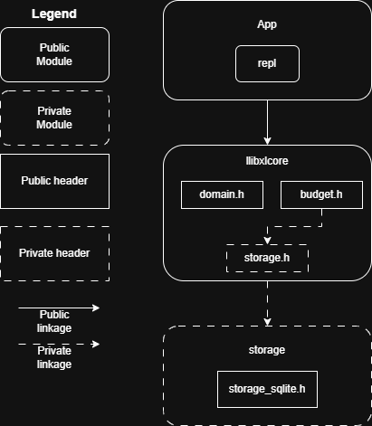

# architecture.md

**Date Created**: March 6, 2026

**Date Updated**: March 24, 2026

**Author**: A. Huinink

<u>**Document Revision History**</u>

| Revision (M.m)| Revised By    | Date          | Comment       |
| ------------- | ------------- | ------------- | ------------- |
| 1.0           | A. Huinink    | March 24, 2026 | Initial Release| 
| 1.1           | A. Huinink    | March 24, 2026 | Clarified some names and shuffled hierarchy.| 

## 1. Introduction

Describes the general architecture of the XtraLedger (XL) core library and application frontends.

### 1.1 Birds-Eye View

The core library _libxl_ provides the data types, the business logic, and a storage plugin interface.
The app library provides UI wrappers around the core library.

## 2. XL Core library

The core library provides a double-ledger system to handle finance data.

### 2.1 Public Includes

#### 2.1.1 xlcore/xlcore.h

Umbrella include.

#### 2.1.2 xlcore/api.h

Public business logic API.

#### 2.1.3 xlcore/account.h

Account datatype.

#### 2.1.4 xlcore/transaction.h

Transaction data type.

### 2.2 Source

#### 2.2.1 xlcore/api

Public frontend API.

#### 2.2.2 xlcore/domain

Core business logic, account, and transaction data types.

#### 2.2.3 xlcore/storage

Storage interface that decouples domain from storage plugins.

##### 2.2.3.1 storage_plugins/sqlite.cpp

SQLite implementation.

## 3. App 

The app library provides UI wrappers around the business logic.

### 3.1 app/repl

A REPL CLI for interacting with the database (v1 of XL).

### 3.2 app/qt

A Qt GUI for interacting with budget data (TBD, probably v2).
